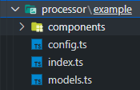

# Code Guidelines

This section discusses some of the decisions that have been made regarding coding style, such as optional properties, exporting types / interfaces and validation.

## Managing Configurations

Configurations should be managed in their respective context, if possible. In our example, that means that our configuration for a given processor is stored in a `model.ts` file in the respective folder. Here is an example:



The contents are as follows:

```typescript
export const CONFIG_KEY = 'processor-example-config';
export const ALTERNATIVE_CONFIG_KEY = 'processor-example-config-json';

export interface IProcessorExampleConfig {
    login_profile?: string;
    name?: string;
}
```

Obviously, for more complex configurations, multiple interfaces within this `model.ts` file are recommended.

## Validation of Configurations

This section showcases a demo scenario in which an example configuration is validated throughout a component life cycle. Key takeaways are the validation types, validation functions and the validation delay.

### Validation Types

There are several UI Elements within a module that require a certain dataset. To assist the user and inform about missing or invalid configurations, helpful error messages are a must have. Therefore, we ensure proper validation on a coding level by using typescript utility types. An example can be seen here:

```typescript
type ConfigRequiredType = keyof Pick<IProcessorExampleConfig, 'login_profile' | 'name'>;
export type ConfigErrorType = Partial<Record<ConfigRequiredType, string>>;
```

First, we pick the properties that require validation or helpful error messages. In this example, that would be the login profile and the name. We use the utility type `Pick<T>` for that matter. After that, we export the `ConfigErrorType` which makes use of the `Partial<T>` utility type. This
combination allows us to create a type safe error object and pass it down to the UI components that require validation.

### Validation Functions

Now we can make use of the `ConfigErrorType` and validate the configuration. Here is an example:

```typescript
export function validateConfig(config: IProcessorExampleConfig, translate?: TFunction): ConfigErrorType {
    const errors: ConfigErrorType = {};

    if (!config.login_profile) {
        errors.login_profile =
            translate?.('exception.ERROR_NO_LOGIN_PROFILE_SELECTED', ERROR_NO_LOGIN_PROFILE_SELECTED) ??
            ERROR_NO_LOGIN_PROFILE_SELECTED;
    }

    if (!config.name) {
        errors.name = translate?.('exception.ERROR_NO_NAME_GIVEN', ERROR_NO_NAME_GIVEN) ?? ERROR_NO_NAME_GIVEN;
    }

    return errors;
}
```

⚠️ **This will cause a rerender on every keystroke for input fields because a new error object is created**

For more complex configurations, such as recursive and nested configurations, using multiple validation functions for each level is advised. Each validation function must be saved in the `validation.ts` file within its current context, e.g: `$PROJECT_ROOT\src\app\processor\example\validation.ts` in case of the example processor.

Separating the configuration functions from React components is very important for multiple reasons. First, the validation functions do not change. Therefore, we do not need to wrap them in a `useCallback` which improves performances. Secondly, separating the functions allows for easier transfer into a new project if a change in the technology stack occurs.

If there is no way around it, the validation function can be within a React component.

### Applying validation

As mentioned previously, validating the configuration triggers a rerender for each keystroke (if an input field will be validated). Not every keystroke needs to be verified though. In some cases, the user might enter valid input and the validation can happen afterwards. This behviour can be seen here:

```typescript
// Validate configuration with a delay to prevent unnecessary rerender
useEffect(() => {
    clearTimeout(timeoutIdRef.current);

    timeoutIdRef.current = setTimeout(() => {
        const errors = validateConfig(config, translate);
        const isValid = Object.keys(errors).length === 0;

        DesignerAPI.processor.setValidityState(isValid);

        setErrors(errors);
    }, VALIDATION_TIMEOUT);
}, [config, translate]);
```

This technique can also be used for Designer API functions such as `setConfigState` to prevent rerenders in rapid succession of an entire side panel.

Now that we have the errors, we can provide this information to child components. Consider the following props for a given component:

```typescript
interface IProcessorExampleConfigProps {
    ...
    errors: ConfigErrorType;
    ...
}
```

We can see that the component expects an error object with the corresponding error type. This gives a developer an easy way to know where to apply the error message. See here:

```tsx
<SyntaxTextField errorMessage={props.errors.name} value={props.config.name ?? ''} />
```

## Exporting Types or Interfaces

In the previous prop example, we can see that the `IProcessorExampleConfigProps` props are not exported. This is not required and should not be done unless the props are reused. The same applies to the validation types. Only the types that construct the error objects are exported.

An example for a reusable Props interface can be seen here:

```typescript
export interface IRepositoryConfigProps<T, E> {
    config: T;
    errors: E;

    onChange: (config: T) => void;
}
```

Another component can use this interface now:

```typescript
interface IRepositoryFileConfigProps extends IRepositoryConfigProps<IRepositoryItem, FileErrorType> {
    contextMenuItems?: ISyntaxFieldCategory[];
}
```

Although this is a convenient approach to construct props for a React component, doing it manually might be more readable. This is in the eye of the beholder. Both approaches are accepted.

## Optional Properties

Interfaces might be constructed completely from optional properties. This causes a problem during development and maintenance because a developer might miss the property because typescript will not complain. Another problem is object spreading. With completely optional interfaces, an object spread is valid as long as one property matches. This can cause problems if the props of a parent component are spread on top of a child component. That child component now has access to information / functions it should not have or is missing information / functions it should have.

Therefore interfaces should not make properties optional unless strictly necessarry (such as compatiblity with third party libraries). This way we can let typescript work for us and make sure that we provide the functions necessarry for the component.

We can see this in the previous two examples. Both `config: T` and `error: E` are always required. The same applies to the `onChange: (config: T) => void` callback.

The same princilbe should be applied when writing functions. Parameters should not be optional unless a third party library requires such parameters.

A little refresher: the declaration of our validation function:

```typescript
export function validateConfig(config: IProcessorExampleConfig, translate?: TFunction);
```

An optional config parameter would allow the following function call:

```typescript
validateConfig();
```

Although this would raise a lot of red flags during development because this call would always generate errors, a developer who did not work on a repository previously has to find this problem first. A required parameter would prevent such a time investment early on. The same applies to other common mistakes such as missing context menu items.

The optional translate function allows this function be used without any translation and make use of default error messages. This would be a valid reason to make a parameter optional, although a developer might miss it and wonder why the error messages are not being translated. But the flexibility is more valuable in the long run.
