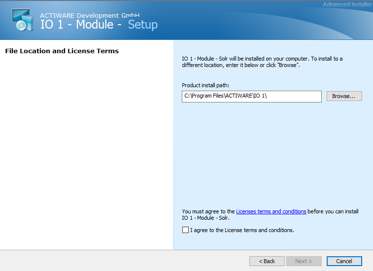
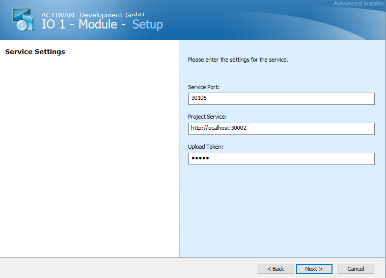

# Installation des Moduls für den Betrieb in Windows
Um das Modul unter Windows zu installieren benötigen wir zunächst einmal die Setup-Datei. Wenn wir diese heruntergeladen haben, führen wir sie aus und klicken uns durch die Setup-Konfiguration.

Im Setup haben wir initial die Möglichkeit den Installationsordner des Moduls zu bestimmen. Anschließend müssen wir die Lizenzbedingungen akzeptieren und das Ganze mit einem Klick auf 'Next' bestätigen.

Anschließend können wir die Service-Einstellungen setzen. Hier können der Port des cache-Services gesetzt sowie der Projekt-Service und ein Upload Token angegeben werden. Wenn wir diese Informationen hinterlegt haben, können wir dies mit einem Klick auf ‘Next' bestätigen und dann via 'Install’-Button die Installation auf unserem System starten.